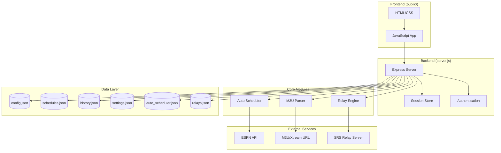
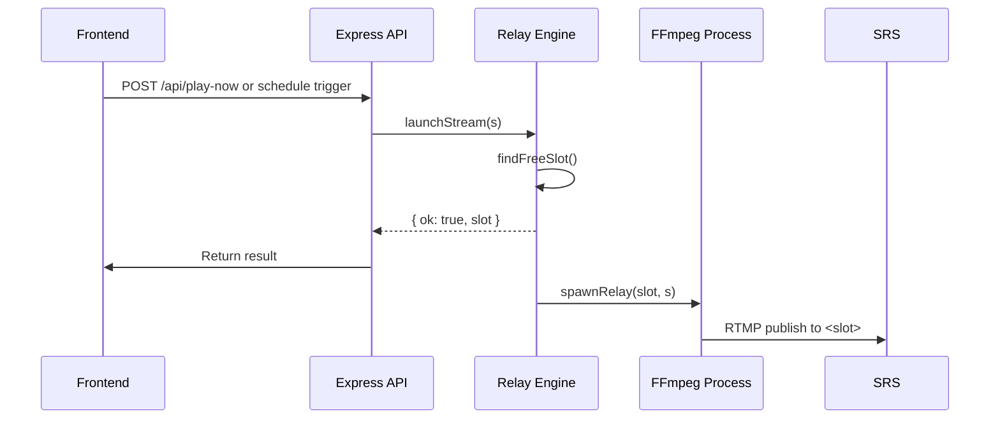
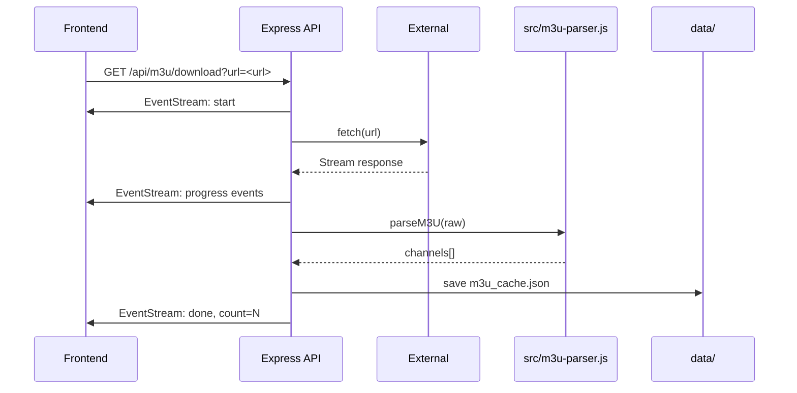
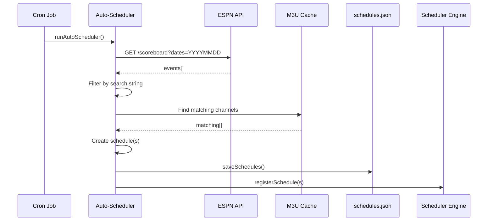

# Stream Scheduler - Project Documentation for AI Agents

## Overview

**Stream Scheduler** is a Node.js-based stream URL scheduler with Xtream/M3U support. It allows users to schedule streams (particularly sports broadcasts) to play at specific times, manage multiple relay slots, and automatically discover games via API integration. The application runs as an HTTP server with a web dashboard for management.

---

## Project Structure

```
stream-scheduler/
├── bin/                          # FFmpeg binary directory
│   └── ffmpeg.exe                # Windows FFmpeg executable (optional)
├── public/                       # Static frontend files
│   ├── app.js                    # Frontend JavaScript application
│   ├── index.html                # Main dashboard UI
│   ├── login.html                # Login page
│   ├── style.css                 # Application styles
│   └── fonts/                    # Inter font family (WOFF2)
├── src/                          # Core server modules
│   ├── m3u-parser.js             # M3U playlist parser
│   ├── relay-engine.js           # FFmpeg relay process manager
│   └── auto-scheduler.js         # ESPN API-based game scheduler
├── data/                         # Persisted JSON files (created at runtime)
│   ├── config.json               # Admin credentials and port
│   ├── schedules.json            # Stream schedule definitions
│   ├── history.json              # Recent stream playback history
│   ├── settings.json             # Server configuration
│   ├── auto_scheduler.json       # Auto-scheduler configuration
│   └── relays.json               # Active relay state
├── logs/                         # FFmpeg debug logs (optional)
├── AGENTS.md                     # This file
├── README.md                     # User-facing documentation
├── package.json                  # Dependencies and scripts
├── server.js                     # Main Express application entry point
├── setup.js                      # Initial configuration wizard
└── start.bat                     # Windows startup script
```

---

## Architecture Diagram



---

## Core Components

### 1. Main Server (`server.js`)

The Express application orchestrates all functionality:

**Configuration:**
- Port: Configurable via `data/config.json` (default: 3000)
- Admin authentication via bcrypt-hashed credentials
- Session storage persisted to `data/sessions.json`

**Key Data Files:**
| File | Purpose |
|------|---------|
| `config.json` | Admin username, password hash, session secret |
| `schedules.json` | Array of scheduled stream definitions |
| `history.json` | Last 10 playback history entries |
| `settings.json` | Server-wide settings (timezone, SRS URLs, max slots) |
| `auto_scheduler.json` | Auto-scheduler config and activity log |
| `relays.json` | Active relay state with process info |

**API Endpoints:**

| Method | Endpoint | Description |
|--------|----------|-------------|
| GET | `/api/ping` | Health check, returns boot ID |
| POST | `/api/system/restart` | Restarts the service |
| POST | `/api/auth/login` | Admin login |
| POST | `/api/auth/logout` | Admin logout |
| POST | `/api/auth/change-password` | Update admin password |
| GET/PUT | `/api/settings` | Get/update server settings |
| GET/POST/DELETE | `/api/schedules` | CRUD for schedules |
| POST | `/api/play-now` | Launch stream immediately |
| GET | `/api/history` | Playback history |
| GET | `/api/relays` | Active relay states |
| POST | `/api/relays/:slot/stop` | Stop specific relay |
| GET/POST | `/api/m3u/download` | Download and parse M3U via SSE |
| POST | `/api/m3u/search` | Search channels in loaded M3U |
| GET | `/api/m3u/cache-info` | Get cached M3U metadata |
| GET | `/api/auto-scheduler` | Auto-scheduler config |
| PUT/POST | `/api/auto-scheduler/*` | Configure and run auto-scheduler |
| GET | `/api/events` | SSE endpoint for dashboard events |
| GET | `/api/proxy-image` | Proxy images (fixes mixed content) |

### 2. M3U Parser (`src/m3u-parser.js`)

Parses M3U playlist files into structured channel data:

**Output Format:**
```javascript
{
  name: "Channel Name",
  url: "http://stream-url.ts",
  logo: "https://logo-url.png",
  group: "Sports Group",
  id: "tvg-id-value",
  searchName: "channel name lowercase",
  eventTime: "2024-01-15T19:30" // extracted from tvg-name if present
}
```

**Parsing Features:**
- Extracts metadata from `#EXTINF:` lines
- Supports `tvg-logo`, `group-title`, `tvg-id` attributes
- Detects embedded event times in format `(YYYY-MM-DD HH:MM)` or `(YYYY-MM-DDTHH:MM)`
- Uses `tvg-name` for full "Channel | Event" strings when available

### 3. Relay Engine (`src/relay-engine.js`)

Manages FFmpeg processes that relay streams to SRS (Simple Realtime Server):

**FFmpeg Arguments:**
```bash
ffmpeg -re -fflags +genpts+discardcorrupt \
  -reconnect 1 -reconnect_at_eof 1 -reconnect_streamed 1 -reconnect_delay_max 5 \
  -rw_timeout 5000000 \
  -i <input_url> \
  -c:v libx264 -preset veryfast -tune zerolatency -crf 23 -g 60 \
  -c:a aac -b:a 128k \
  -f flv -flvflags no_duration_filesize \
  rtmp://<srs-url>/<slot>
```

**Features:**
- Detached process spawning for long-running streams
- Auto-restart on unexpected exit (3-second delay)
- Crash detection via exit code monitoring
- Slot management with configurable max concurrent streams (1-5)
- Preferred slot assignment support

### 4. Auto-Scheduler (`src/auto-scheduler.js`)

Automatically creates schedules for sports games using ESPN API:

**Workflow:**
1. Fetches today's games from configured ESPN API endpoint
2. Filters games matching search string (team name or location)
3. Finds corresponding M3U channels with matching team + date
4. Creates one-time schedule for game start time (+ configurable offset)
5. Registers schedule with cron job

**Configuration:**
- `searchString`: Team/location to match (e.g., "Texas Tech")
- `apiEndpoint`: ESPN scoreboard API URL
- `checkTime`: Daily check time (HH:MM format)
- `startOffset`: Minutes to add to game start time
- `refreshBeforeRun`: Whether to refresh M3U before running

---

## Data Flow Diagrams

### Stream Launch Flow



### M3U Download Flow



### Auto-Scheduler Flow



---

## Configuration Files

### `data/config.json` (Created by setup.js)
```json
{
  "port": 3000,
  "username": "admin",
  "passwordHash": "$2a$12$...",
  "sessionSecret": "hex-string-64-chars"
}
```

### `data/settings.json` (Defaults)
```json
{
  "timezone": "America/New_York",
  "srsUrl": "rtmp://192.168.1.125/live",
  "srsWatchUrl": "https://stream.ipnoze.com/live",
  "maxSlots": 2,
  "m3uAutoRefresh": false,
  "m3uRefreshTime": "06:00",
  "debugLogging": false,
  "ffmpegLogPath": "./logs",
  "ffmpegLogMaxSizeMb": 10
}
```

### `data/auto_scheduler.json` (Defaults)
```json
{
  "enabled": false,
  "searchString": "Texas Tech",
  "apiEndpoint": "https://site.api.espn.com/apis/site/v2/sports/baseball/college-baseball/scoreboard",
  "checkTime": "07:00",
  "startOffset": 10,
  "refreshBeforeRun": false,
  "preferredSlot": null,
  "activityLog": []
}
```

---

## Key Design Patterns

### 1. File-Based Persistence
All state is persisted to JSON files in `data/`. This enables:
- Zero external database dependencies
- Easy backup/migration
- Survives server restarts (with state restoration)

### 2. In-Memory State with Periodic Sync
Active relay processes and schedules exist in memory but are periodically saved. On startup, previous relay states are restored by killing old FFmpeg processes and respawning them.

### 3. SSE for Real-Time Updates
Server-Sent Events provide live updates to:
- Dashboard (relay state changes, history)
- Auto-scheduler (activity log entries)

### 4. Detached Child Processes
FFmpeg is spawned with `detached: true` and `proc.unref()` so Node.js doesn't exit while streams are running.

---

## Dependencies

| Package | Version | Purpose |
|---------|---------|---------|
| express | ^4.18.2 | Web framework |
| express-session | ^1.17.3 | Session management |
| bcryptjs | ^2.4.3 | Password hashing |
| node-cron | ^3.0.3 | Scheduled tasks |
| uuid | ^9.0.0 | UUID generation |

---

## External Dependencies

- **FFmpeg**: Required for stream relay (must be in PATH or `bin/ffmpeg.exe`)
- **SRS Server**: RTMP destination for relayed streams
- **ESPN API** (optional): For auto-scheduler game discovery

---

## Common Operations

### Starting the Service
```bash
node server.js
# Or use Windows batch file:
start.bat
```

### Initial Setup
```bash
node setup.js
# Interactive wizard creates config.json with admin credentials
```

### Restarting via API
```bash
curl -X POST http://localhost:3000/api/system/restart
```

---

## Troubleshooting Checklist

| Issue | Likely Cause | Solution |
|-------|--------------|----------|
| "config.json not found" | Missing setup | Run `node setup.js` |
| FFmpeg spawn fails | FFmpeg not in PATH | Place `ffmpeg.exe` in project root or set PATH |
| No relays starting | SRS URL incorrect | Check `settings.srsUrl` format |
| Auto-scheduler no games | API endpoint wrong | Verify ESPN API URL and date format |
| Session timeout | Cookie settings | Check `config.sessionSecret` is unique |

---

## Security Considerations

- Admin authentication via bcrypt (12 rounds)
- Session secret generated randomly on setup
- Password change updates hash in config.json
- Image proxy validates content-type and size limits
- API endpoints protected by session middleware

---

## Extending Functionality

### Adding New Schedule Types
1. Add schedule type to `server.js` schedule creation logic (line ~272)
2. Update `registerSchedule()` function (lines 481-505) to handle new type
3. Ensure UI modal includes option for new type

### Adding New Data Sources
1. Create parser module in `src/` following `m3u-parser.js` pattern
2. Add API endpoint in `server.js` to fetch and parse data
3. Wire into existing schedule creation flow

### Customizing Auto-Scheduler
- Modify ESPN API filtering logic in `auto-scheduler.js` (lines 63-145)
- Support additional sports APIs by changing `apiEndpoint` config
- Add team logo fetching from external sources

---

## Testing Recommendations

1. **Unit Tests**: Test M3U parser with various playlist formats
2. **Integration Tests**: Verify schedule creation and cron registration
3. **E2E Tests**: Frontend UI flows (login, channel search, schedule creation)
4. **Load Tests**: Multiple concurrent relay streams under load

---

## Version Information

- **Version**: 1.0.0
- **Node.js**: Requires Node.js 18+ (for Web Streams API in M3U download)
- **Platform**: Windows/Linux/macOS (FFmpeg binary may need platform-specific handling)
