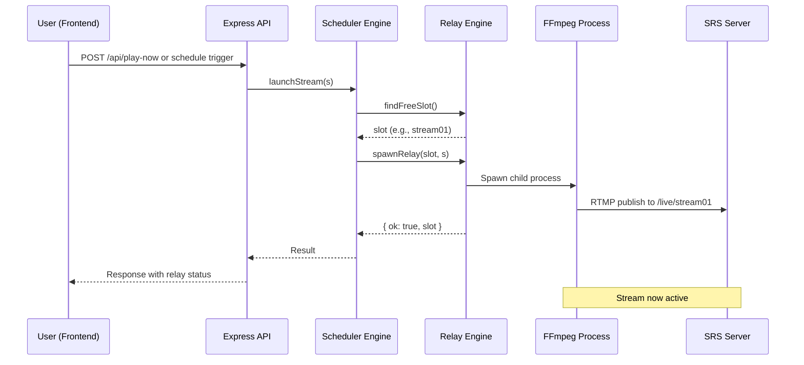
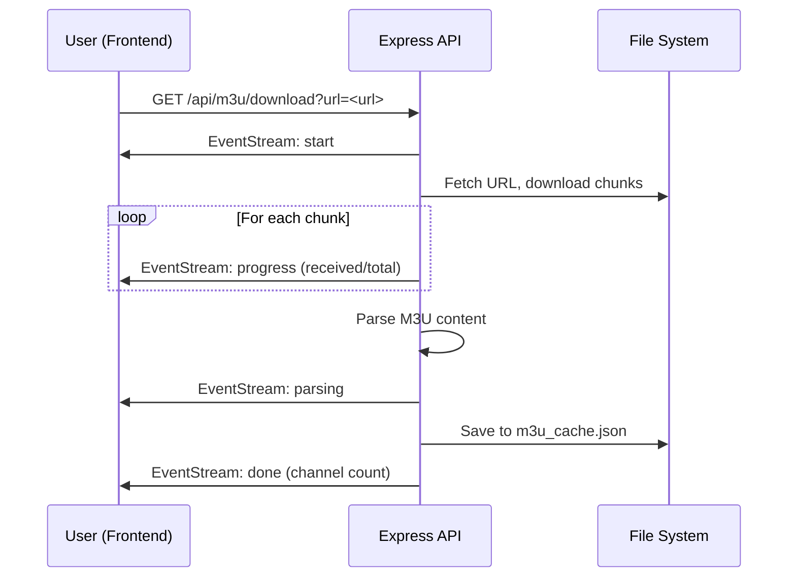
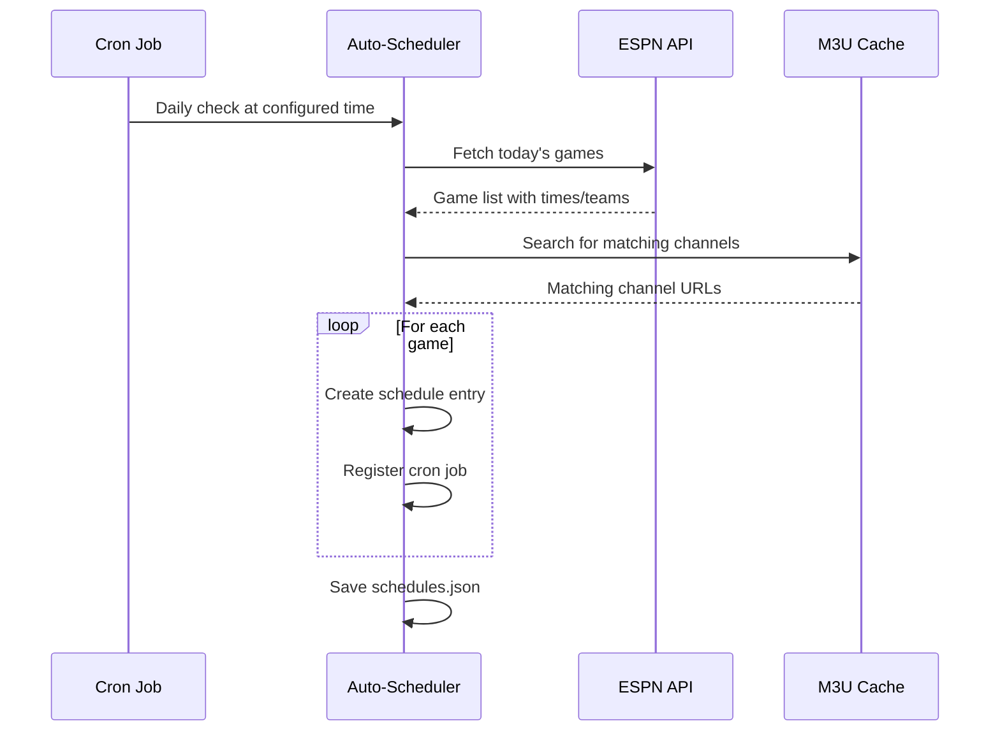
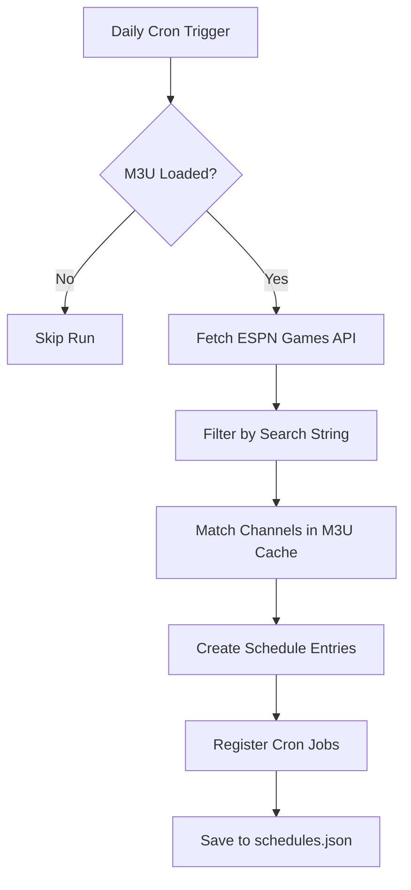

# Stream Scheduler - Project Encyclopedia for AI Agents

## Table of Contents

- [Overview](#overview)
- [Architecture](#architecture)
- [Directory Structure](#directory-structure)
- [Core Components](#core-components)
- [Data Flow](#data-flow)
- [API Reference](#api-reference)
- [Storage & Persistence](#storage--persistence)
- [Key Workflows](#key-workflows)
- [Development Guidelines](#development-guidelines)

---

## Overview

**Stream Scheduler** is a Node.js-based application that enables users to schedule and relay live video streams using FFmpeg. It supports M3U playlist parsing, Xtream authentication URLs, recurring schedules, and an auto-scheduler feature that integrates with the ESPN API to automatically create schedules for sports games.

### Key Features

- **Stream Relaying**: Uses FFmpeg to ingest streams and publish them to SRS (Simple Realtime Server) via RTMP
- **Schedule Management**: Create one-time or recurring stream schedules
- **M3U/Xtream Support**: Parse M3U playlists and Xtream authentication URLs for channel management
- **Auto-Scheduler**: Automatically create schedules based on ESPN sports API data
- **Real-Time Updates**: Server-Sent Events (SSE) for live dashboard updates
- **Multi-Stream Support**: Configurable number of concurrent streams (1-5 slots)

### Tech Stack

| Layer | Technology |
|-------|------------|
| Runtime | Node.js |
| Web Framework | Express 4.x |
| Session Management | express-session with file-based store |
| Scheduling | node-cron |
| Password Hashing | bcryptjs |
| UUID Generation | uuid |
| Frontend | Vanilla JavaScript + HLS.js |

---

## Architecture

```mermaid
graph TB
    subgraph "Frontend (public/)"
        HTML[HTML/CSS]
        JS[JavaScript app.js]
        HLS[HLS.js]
    end
    
    subgraph "Backend (server.js)"
        APP[Express App]
        AUTH[Auth Middleware]
        API[API Routes]
        SCHED[Scheduler Engine]
        M3U[M3U Parser]
        AUTO[AUTO-Scheduler]
    end
    
    subgraph "External Services"
        ESPN[ESPN Sports API]
        SRS[SRS Relay Server]
    end
    
    subgraph "Storage (data/)"
        CONFIG[config.json]
        SCHEDS[schedules.json]
        RELAYS[relays.json]
        HISTORY[history.json]
        M3U_CACHE[m3u_cache.json]
        AUTO_SCHED[auto_scheduler.json]
        SETTINGS[settings.json]
    end
    
    subgraph "System Processes"
        FFMPEG[FFmpeg (spawned)]
    end
    
    HTML --> JS
    JS --> API
    APP --> AUTH
    APP --> SCHED
    APP --> M3U
    APP --> AUTO
    API --> ESPN
    SCHED --> FFMPEG
    FFMPEG --> SRS
    API --> CONFIG
    API --> SCHEDS
    API --> RELAYS
    API --> HISTORY
    API --> M3U_CACHE
    API --> AUTO_SCHED
    API --> SETTINGS
    
    style APP fill:#4CAF50,color:white
    style FFMPEG fill:#2196F3,color:white
    style ESPN fill:#FF9800,color:black
```

---

## Directory Structure

```
stream-scheduler/
├── .gitattributes          # Git attributes for line endings
├── .gitignore             # Git ignore patterns
├── LICENSE                # Project license
├── package.json           # Dependencies and scripts
├── setup.js               # Initial configuration wizard
├── server.js              # Main Express application entry point
├── start.bat              # Windows startup script
├── bin/                   # FFmpeg binary directory
│   └── ffmpeg.exe         # Windows FFmpeg executable
├── public/                # Static frontend files
│   ├── app.js             # Client-side JavaScript (1399 lines)
│   ├── favicon-*.png      # Favicon assets
│   ├── index.html         # Main dashboard HTML
│   ├── login.html         # Authentication page
│   ├── logo.svg           # Application logo
│   ├── style.css          # Stylesheet
│   └── fonts/             # Inter font family (WOFF2)
├── src/                   # Source modules
│   ├── auto-scheduler.js  # ESPN API integration logic
│   ├── m3u-parser.js      # M3U playlist parser
│   └── relay-engine.js    # FFmpeg relay management
├── data/                  # Persisted JSON files (created on setup)
│   ├── config.json        # Admin credentials and port
│   ├── schedules.json     # Stream schedule definitions
│   ├── relays.json        # Active relay state
│   ├── history.json       # Recent stream activity log
│   ├── settings.json      # Application settings
│   └── auto_scheduler.json# Auto-scheduler configuration
├── logs/                  # FFmpeg debug logs (when enabled)
└── README.md              # Project documentation
```

---

## Core Components

### 1. Server (`server.js`)

The main Express application that orchestrates all functionality.

**Key Responsibilities:**
- Session management with file-based store
- Authentication middleware and routes
- API endpoint routing
- Cron job registration for schedules
- M3U cache management
- SSE event broadcasting

**Major Sections:**

```javascript
// Configuration paths (lines 14-20)
const DATA_DIR = path.join(__dirname, 'data');
const CONFIG_PATH = path.join(DATA_DIR, 'config.json');
const SCHED_PATH = path.join(DATA_DIR, 'schedules.json');
// ... more paths

// Persistence helpers (lines 35-44)
const readJSON = (p, def) => { /* ... */ };
const writeJSON = (p, d) => { /* ... */ };

// Relay engine initialization (lines 80-96)
const relays = new Map(); // slot → relay state
const createRelayEngine = require('./src/relay-engine');

// Session store (lines 118-133)
class FileStore extends session.Store { /* ... */ }

// Express app setup (lines 135-145)
const app = express();
app.use(express.json({ limit: '10mb' }));
app.use(session({ store: new FileStore(), ... }));

// API routes throughout the file
```

### 2. Relay Engine (`src/relay-engine.js`)

Manages FFmpeg processes for stream relaying.

**Key Functions:**
- `spawnRelay(slot, s)` - Starts a new FFmpeg process
- `killRelay(slot)` - Stops an active relay
- `launchStream(s)` - Orchestrates stream launch with slot allocation

**FFmpeg Arguments:**
```bash
ffmpeg [options] -i <input_url> -c:v libx264 ... -f flv <srs_output>
```

Key FFmpeg flags:
| Flag | Value | Purpose |
|------|-------|---------|
| `-re` | (default) | Read input as a continuous stream |
| `-fflags +genpts+discardcorrupt` | | Generate PTS, discard corrupt packets |
| `-c:v libx264` | | H.264 video codec |
| `-preset veryfast` | | Fast encoding preset |
| `-tune zerolatency` | | Low latency tuning |
| `-g 60` | | GOP size (keyframe interval) |
| `-c:a aac -b:a 128k` | | AAC audio at 128kbps |
| `-f flv` | | FLV output format for SRS |

### 3. M3U Parser (`src/m3u-parser.js`)

Parses M3U playlist files to extract channel metadata.

**Output Format:**
```javascript
{
  name: "Channel Name",
  logo: "https://example.com/logo.png",
  group: "Sports",
  id: "channel-id-123",
  url: "http://stream.example.com/live.m3u8"
}
```

**Metadata Extracted:**
- `name` - Channel display name (from EXTINF or URL line)
- `logo` - TVG logo URL
- `group` - Group title/category
- `id` - TVG ID for identification
- `eventTime` - ISO timestamp if present in tvg-name

### 4. Auto-Scheduler (`src/auto-scheduler.js`)

Integrates with ESPN Sports API to auto-create schedules.

**Workflow:**
1. Fetch today's games from ESPN API
2. Filter by search string (e.g., "Texas Tech")
3. Match channels in M3U cache by name and date
4. Create one-time schedule entries for matching games
5. Register schedules with cron jobs

**ESPN API Endpoint:**
```
https://site.api.espn.com/apis/site/v2/sports/baseball/college-baseball/scoreboard?dates=YYYYMMDD
```

---

## Data Flow

### Stream Launch Flow



### M3U Download Flow



### Auto-Scheduler Flow



---

## API Reference

### Authentication

| Method | Endpoint | Description |
|--------|----------|-------------|
| POST | `/api/auth/login` | Login with username/password |
| POST | `/api/auth/logout` | Logout current session |
| POST | `/api/auth/change-password` | Change admin password |

**Login Request:**
```json
{ "username": "admin", "password": "hashed_password" }
```

### System

| Method | Endpoint | Description |
|--------|----------|-------------|
| GET | `/api/ping` | Health check, returns boot ID |
| POST | `/api/system/restart` | Restart the service |

### Settings

| Method | Endpoint | Description |
|--------|----------|-------------|
| GET | `/api/settings` | Get current settings |
| PUT | `/api/settings` | Update settings |

**Settings Object:**
```json
{
  "timezone": "America/New_York",
  "srsUrl": "rtmp://192.168.1.125/live",
  "srsWatchUrl": "https://stream.ipnoze.com/live",
  "maxSlots": 2,
  "m3uAutoRefresh": false,
  "m3uRefreshTime": "06:00",
  "debugLogging": false,
  "ffmpegLogPath": "./logs",
  "ffmpegLogMaxSizeMb": 10
}
```

### Schedules

| Method | Endpoint | Description |
|--------|----------|-------------|
| GET | `/api/schedules` | List all schedules |
| POST | `/api/schedules` | Create new schedule |
| PUT | `/api/schedules/:id` | Update schedule |
| DELETE | `/api/schedules/:id` | Delete schedule |

**Schedule Object:**
```json
{
  "id": "uuid-v4",
  "name": "Channel Name",
  "url": "http://stream.example.com/live.m3u8",
  "logo": "https://...",
  "scheduleType": "once" | "cron",
  "runAt": "2026-01-15T20:00:00.000Z",
  "frequency": "daily" | "weekly" | "monthly",
  "recurTime": "20:00",
  "recurDay": 1,
  "preferredSlot": "stream01",
  "enabled": true,
  "createdAt": "ISO timestamp",
  "lastRun": "ISO timestamp",
  "nextRun": "ISO timestamp"
}
```

### Relays

| Method | Endpoint | Description |
|--------|----------|-------------|
| GET | `/api/relays` | List active relays |
| POST | `/api/relays/:slot/stop` | Stop relay on slot |

**Relay Object:**
```json
{
  "slot": "stream01",
  "name": "Channel Name",
  "url": "http://...",
  "logo": "https://...",
  "startedAt": "ISO timestamp"
}
```

### M3U Management

| Method | Endpoint | Description |
|--------|----------|-------------|
| GET | `/api/m3u/cache-info` | Get cache status |
| POST | `/api/m3u/use-cache` | Use cached M3U |
| GET | `/api/m3u/download?url=<url>` | Download and parse M3U (SSE) |
| POST | `/api/m3u/search` | Search channels in cache |

**Search Response:**
```json
{
  "count": 150,
  "total": 2000,
  "channels": [...] // up to 500 results
}
```

### Auto-Scheduler

| Method | Endpoint | Description |
|--------|----------|-------------|
| GET | `/api/auto-scheduler` | Get configuration |
| PUT | `/api/auto-scheduler` | Update configuration |
| POST | `/api/auto-scheduler/enable` | Enable auto-scheduler |
| POST | `/api/auto-scheduler/disable` | Disable auto-scheduler |
| POST | `/api/auto-scheduler/run` | Trigger manual run |

**Auto-Scheduler Config:**
```json
{
  "enabled": false,
  "searchString": "Texas Tech",
  "apiEndpoint": "https://site.api.espn.com/...",
  "checkTime": "07:00",
  "startOffset": 10,
  "refreshBeforeRun": false,
  "preferredSlot": null,
  "activityLog": [...]
}
```

### Real-Time Events (SSE)

| Endpoint | Description | Event Types |
|----------|-------------|-------------|
| `/api/events` | Dashboard updates | `relays`, `schedule`, `history` |
| `/api/auto-scheduler/events` | Auto-scheduler activity | Activity log entries, `run-complete` |

---

## Storage & Persistence

### Data Directory Structure (`data/`)

```json
// config.json - Admin credentials and server port
{
  "port": 3000,
  "username": "admin",
  "passwordHash": "$2a$12$...",
  "sessionSecret": "hex-encoded-random-bytes"
}

// schedules.json - All scheduled streams
[
  { /* schedule objects */ }
]

// relays.json - Currently active relay states
[
  {
    "slot": "stream01",
    "name": "Channel Name",
    "url": "...",
    "logo": "...",
    "startedAt": "ISO timestamp"
  }
]

// history.json - Recent activity (max 10 entries)
[
  {
    "id": "uuid-v4",
    "scheduleId": "uuid or null",
    "scheduleName": "...",
    "url": "...",
    "logo": "...",
    "player": "stream01",
    "startedAt": "ISO timestamp",
    "status": "launched"
  }
]

// settings.json - Application configuration
{ /* settings object */ }

// auto_scheduler.json - Auto-scheduler state
{
  "enabled": false,
  "searchString": "...",
  "apiEndpoint": "...",
  "checkTime": "07:00",
  "startOffset": 10,
  "refreshBeforeRun": false,
  "preferredSlot": null,
  "activityLog": [...] // max 100 entries
}

// m3u_cache.json - Parsed M3U playlist (optional)
{
  "fetchedAt": timestamp,
  "sourceUrl": "...",
  "byteSize": number,
  "channels": [ /* channel objects */ ]
}
```

### Session Storage (`data/sessions.json`)

Session data stored as JSON:
```json
{
  "<session-id>": {
    "authenticated": true
  }
}
```

---

## Key Workflows

### 1. Initial Setup

```bash
# Run setup wizard to create config
node setup.js

# Start the server
node server.js

# Access at http://localhost:3000
```

The setup wizard creates `data/config.json` with:
- Admin username and password (bcrypt hashed)
- Server port
- Random session secret

### 2. Loading M3U Playlist

1. User enters M3U/Xtream URL in Settings page
2. Clicks "Get" button
3. Server downloads via SSE progress updates
4. Parses M3U content using `src/m3u-parser.js`
5. Saves to `data/m3u_cache.json`
6. Enables channel search functionality

### 3. Creating a Schedule

**One-Time Schedule:**
1. Search channels in M3U cache
2. Click on channel → "Add to Schedule" modal
3. Enter name, select slot, choose "One-time"
4. Set run time (datetime-local input)
5. Save → Creates schedule + registers timeout cron job

**Recurring Schedule:**
1. Same as above but select "Recurring"
2. Choose frequency (daily/weekly/monthly)
3. Set recurrence details
4. Save → Creates schedule + registers cron expression job

### 4. Auto-Scheduler Execution



---

## Development Guidelines

### Adding New API Endpoints

1. Define route in `server.js` using Express router pattern
2. Add authentication middleware for protected routes:
   ```javascript
   app.use('/api', require('./src/middleware/auth'));
   ```
3. Implement request handler with proper error handling
4. Return consistent JSON responses:
   - Success: `{ ok: true, data: {...} }` or just the data object
   - Error: `{ ok: false, error: 'Error message' }`

### Adding New Schedule Types

1. Extend `src/m3u-parser.js` if new metadata needed
2. Update schedule validation in server routes
3. Add cron expression parsing for recurring schedules
4. Ensure SSE events broadcast schedule changes

### FFmpeg Relay Changes

1. Modify arguments in `src/relay-engine.js`
2. Test with sample streams before deployment
3. Monitor logs at configured path when debug enabled
4. Consider log rotation based on max size setting

### Frontend JavaScript Patterns

The frontend uses vanilla JavaScript with these conventions:
- All functions are async where they await API calls
- SSE connections use `makeSSE()` helper for reconnection logic
- Modals controlled by `.show` CSS class toggle
- Toast notifications via `toast(msg, type)` function
- Debounced inputs prevent excessive API calls

### Common Utilities

```javascript
// Escaping HTML output
function esc(s) { return String(s||'').replace(/&/g,'&')... }

// Date formatting
function fmtDt(iso) { /* returns localized date string */ }

// UUID generation (via uuid package)
const id = crypto.randomUUID(); // or uuid.v4()

// File system operations
const fs = require('fs');
const readJSON = (p, def) => JSON.parse(fs.readFileSync(p, 'utf8') || JSON.stringify(def));
```

---

## Troubleshooting Common Issues

### FFmpeg Not Starting
- Verify `bin/ffmpeg.exe` exists and is executable
- Check SRS URL in settings matches actual SRS server
- Ensure RTMP port is not blocked by firewall

### M3U Download Fails
- Xtream URLs require authentication headers (handled by server)
- Network connectivity to source URL
- Check CORS if using non-standard ports

### Schedule Not Triggering
- Verify cron expression format: `* * * * *` (minute hour day month weekday)
- Check `data/schedules.json` for enabled flag
- Review activity log in auto-scheduler page

### Relay Stuck/Not Publishing
- Check FFmpeg logs at configured path
- Verify SRS server is running and accepting RTMP connections
- Test stream URL directly with VLC or similar player

---

## Environment Variables (Optional)

The application can be extended with environment variables:

```bash
# Server configuration
PORT=3000
NODE_ENV=production

# External services
ESPN_API_KEY=your-api-key
SRS_HOST=localhost
SRS_PORT=1935

# Logging
LOG_LEVEL=info
FFMPEG_LOG_PATH=./logs
```

---

## License & Credits

This project uses:
- **Inter Font** - Licensed under SIL Open Font License
- **HLS.js** - MIT License for HLS playback
- **Express** - MIT License
- **bcryptjs** - MIT License

See `LICENSE` file for full terms.

---

*Last Updated: 2026-01-15*