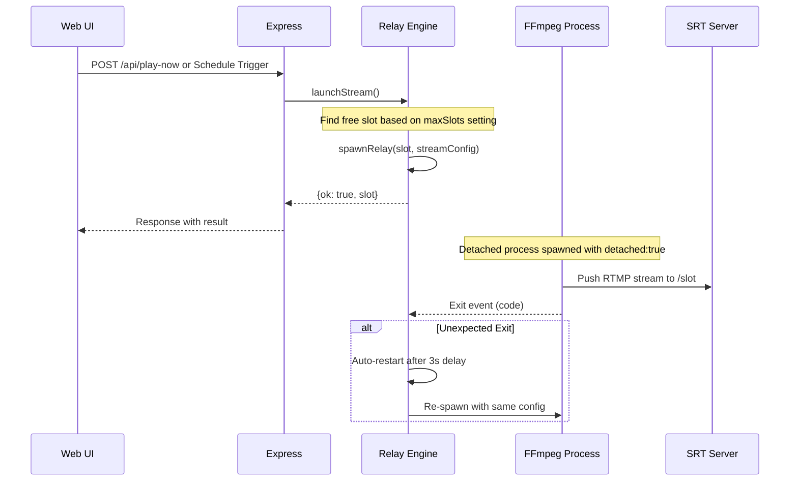
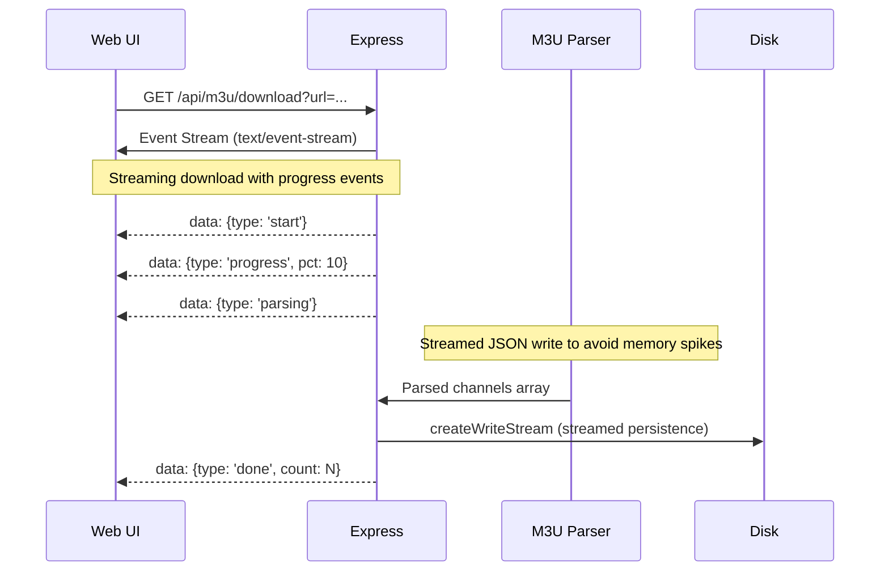

# Stream Scheduler - ROO.md

This document serves as a reference guide for AI agents to understand, debug, and improve the Stream Scheduler project.

---

## Table of Contents

1. [Project Overview](#project-overview)
2. [Architecture Diagrams](#architecture-diagrams)
3. [File Structure](#file-structure)
4. [Core Components](#core-components)
5. [Data Flow](#data-flow)
6. [API Endpoints](#api-endpoints)
7. [Common Issues & Debugging](#common-issues--debugging)
8. [Configuration Reference](#configuration-reference)

---

## Project Overview

**Stream Scheduler** is a self-hosted web application that schedules and relays IPTV streams using FFmpeg to push to an SRS (Simple Realtime Server) instance. It provides a modular architecture with three main engines: Relay Engine, M3U Parser, and Auto-Scheduler.

### Key Technologies
- **Runtime**: Node.js 18+
- **Web Framework**: Express 4.x
- **Session Management**: express-session with file-based storage
- **FFmpeg**: Process spawning for stream relay
- **Scheduling**: node-cron for cron jobs and timers
- **Authentication**: bcryptjs for password hashing

### Key Features
- Modular architecture with dedicated service engines
- Detached FFmpeg processes that survive server restarts
- Real-time SSE (Server-Sent Events) updates
- Auto-scheduler for sports events via API integration
- M3U/Xtream Codes parsing and caching
- Session-based authentication with bcrypt

---

## Architecture Diagrams

### System Architecture

```mermaid
graph TB
    subgraph Client
        UI[Web UI / public/]
        SSE[SSE Clients]
    end
    
    subgraph Server
        Express[Express App]
        Auth[Auth Middleware]
        RelayEngine[Relay Engine]
        M3UParser[M3U Parser]
        AutoSched[Auto-Scheduler]
        Cron[Cron Jobs]
    end
    
    subgraph Data
        Config[(config.json)]
        Schedules[(schedules.json)]
        Relays[(relays.json)]
        M3UCache[(m3u_cache.json)]
        Sessions[(sessions.json)]
        Logs[logs/]
    end
    
    subgraph External
        FFmpeg[FFmpeg Process]
        SRS[SRT Server]
        API[Sports API]
        M3USource[M3U Source]
    end
    
    UI -->|HTTP Requests| Express
    SSE -->|SSE Connection| Express
    Auth -->|Protect Routes| Express
    RelayEngine -->|Spawn| FFmpeg
    FFmpeg -->|Push RTMP| SRS
    M3UParser -->|Parse| M3USource
    AutoSched -->|Fetch| API
    Cron -->|Trigger| AutoSched
    Cron -->|Trigger| M3U Refresh
    
    Express <-->|Read/Write| Config
    Express <-->|Read/Write| Schedules
    Express <-->|Read/Write| Relays
    Express <-->|Read/Write| M3UCache
    Express <-->|Read/Write| Sessions
```

### Relay Engine Flow



### M3U Parsing Flow



---

## File Structure

```
stream-scheduler/
├── bin/                    # FFmpeg binary location
│   └── README.txt
├── public/                 # Static web assets
│   ├── app.js              # Frontend JavaScript
│   ├── favicon-*.png       # Favicon variants
│   ├── index.html          # Main dashboard
│   ├── login.html          # Login page
│   ├── logo.svg            # Application logo
│   └── style.css           # Styles (glassmorphic UI)
├── src/                    # Core modules
│   ├── auto-scheduler.js   # Sports event scheduler
│   ├── m3u-parser.js       # M3U/Xtream parser
│   └── relay-engine.js     # FFmpeg process manager
├── data/                   # Persistent data (created on setup)
│   ├── config.json         # Port, username, password hash, session secret
│   ├── schedules.json      # All scheduled streams
│   ├── history.json        # Playback log (last 10 entries)
│   ├── settings.json       # SRS URL, max slots, refresh settings
│   ├── auto_scheduler.json # Auto-scheduler config + activity log
│   ├── m3u_cache.json      # Cached channel list
│   └── relays.json         # Active relay state (PIDs, URLs)
├── logs/                   # FFmpeg debug logs (if enabled)
│   └── ffmpeg-<slot>.log
├── .gitignore              # Git ignore rules
├── package.json            # Dependencies and scripts
├── setup.js                # Initial configuration wizard
├── server.js               # Main application entry point
├── start.bat               # Windows launcher
└── ROO.md                  # This documentation file
```

---

## Core Components

### 1. Server Entry Point ([`server.js`](server.js:1))

The main application file that orchestrates all components.

**Key Responsibilities:**
- Express app initialization with middleware stack
- Session management using custom FileStore
- Authentication routes and middleware
- API endpoint definitions
- Cron job registration (auto-scheduler, M3U refresh)
- Relay engine instantiation
- SSE event broadcasting system
- Startup relay state restoration

**Critical Code Sections:**

```javascript
// Line 80-96: Relay Engine Instantiation
const relays = new Map();
const createRelayEngine = require('./src/relay-engine');
const { killRelay, launchStream, spawnRelay } = createRelayEngine({
  getSettings: () => settings,
  ALL_SLOTS,
  relays,
  FFMPEG_PATH,
  saveRelays: () => saveRelays(),
  logAutoActivity,
  getHistory: () => history,
  saveHistory: () => saveHistory(),
  schedules,
  saveSchedules: () => saveSchedules(),
  serverLog
});

// Line 118-130: Custom FileStore Session Handler
class FileStore extends session.Store {
  constructor(options = {}) {
    super(options);
    this.path = options.path || path.join(DATA_DIR, 'sessions.json');
    try { this.sessions = JSON.parse(fs.readFileSync(this.path)); }
    catch (e) { this.sessions = {}; }
  }
  saveStore() { fs.writeFileSync(this.path, JSON.stringify(this.sessions)); }
  get(sid, cb) { cb(null, this.sessions[sid] || null); }
  set(sid, sess, cb) { this.sessions[sid] = sess; this.saveStore(); if(cb) cb(null); }
}
```

### 2. Relay Engine ([`src/relay-engine.js`](src/relay-engine.js:1))

Manages FFmpeg process lifecycle for stream relaying.

**Key Functions:**
- `spawnRelay(slot, s)` - Detached FFmpeg spawn with exit event handling
- `killRelay(slot)` - Terminate relay by PID or detached process
- `launchStream(s)` - Find free slot and launch relay
- `findFreeSlot(preferred)` - Slot selection logic

**Critical Patterns:**

```javascript
// Line 70: Detached Process Spawning
proc = spawn(FFMPEG_PATH, args, { stdio: ['ignore', 'ignore', stderrTarget], detached: true });
proc.unref(); // Allow Node to exit while FFmpeg runs

// Line 82-109: Exit Event Handler with Auto-Recovery
proc.on('exit', (code) => {
  serverLog(`[Relay:${slot}] FFmpeg exited, code: ${code}`);
  const unexpected = relays.has(slot);
  
  if (unexpected && saved && code !== null) {
    logAutoActivity('info', `Auto-restarting relay ${slot} in 3s…`);
    setTimeout(() => {
      const newProc = spawnRelay(slot, saved);
      // ... re-spawn logic
    }, 3000);
  }
});
```

**FFmpeg Arguments Construction:**

```javascript
// Line 40-52: Stream relay arguments
const args = [
  ...(settings.debugLogging ? ['-loglevel', 'warning'] : []),
  '-re', // Repeat input
  '-fflags', '+genpts+discardcorrupt',
  '-reconnect', '1', '-reconnect_at_eof', '1', '-reconnect_streamed', '1', '-reconnect_delay_max', '5',
  '-rw_timeout', '5000000',
  '-i', s.url, // Input stream URL
  '-c:v', 'libx264', '-preset', 'veryfast', '-tune', 'zerolatency', '-crf', '23',
  '-g', '60',
  '-c:a', 'aac', '-b:a', '128k',
  '-f', 'flv', '-flvflags', 'no_duration_filesize',
  outputUrl // RTMP destination: rtmp://srs/live/stream01
];
```

### 3. M3U Parser ([`src/m3u-parser.js`](src/m3u-parser.js:1))

Lightweight, streamable M3U/Xtream Codes parser.

**Parsing Logic:**

```javascript
// Line 15-42: EXTINF metadata extraction
if (line.startsWith('#EXTINF:')) {
  meta = { name: '', logo: '', group: '', id: '', eventTime: null };
  
  const nameMatch  = line.match(/,(.+)$/);
  const logoMatch  = line.match(/tvg-logo="([^"]*)"/);
  const groupMatch = line.match(/group-title="([^"]*)"/);
  const idMatch    = line.match(/tvg-id="([^"]*)"/);
  const tvgName    = line.match(/tvg-name="([^"]*)"/);
  
  // Extract event time from ISO format in channel name
  const rawName = (tvgName && tvgName[1]) ? tvgName[1] : (nameMatch ? nameMatch[1].trim() : '');
  const isoMatch = rawName.match(/\((\d{4}-\d{2}-\d{2})[T ](\d{2}:\d{2})(?::\d{2})?\)\s*$/);
  if (isoMatch) {
     meta.eventTime = isoMatch[1] + 'T' + isoMatch[2];
  }
  
  channels.push({ ...meta, url: line, searchName: (meta.name || '').toLowerCase() });
}
```

**Special Features:**
- Extracts event time from `tvg-name` attribute for live events
- Normalizes channel names to lowercase for fuzzy matching
- Stores logo URLs and group titles for UI display

### 4. Auto-Scheduler ([`src/auto-scheduler.js`](src/auto-scheduler.js:1))

Automatically schedules sports events by querying APIs and matching channels.

**Workflow:**

```javascript
// Line 38-61: API Fetch with Timeout
const now    = new Date();
const etDate = new Date(now.toLocaleString('en-US', { timeZone: timezone }));
const dateStr = `${yyyy}${mm}${dd}`;

try {
  const controller = new AbortController();
  const timeout = setTimeout(() => controller.abort(), 10000); // 10s timeout
  const resp = await fetch(`${apiEndpoint}?dates=${dateStr}`, { signal: controller.signal });
  clearTimeout(timeout);
  
  if (!resp.ok) throw new Error(`HTTP error! status: ${resp.status}`);
  const data = await resp.json();
  events = data.events || [];
} catch (e) {
  logAutoActivity('error', `API error: ${e.message}`);
  return;
}

// Line 63-69: Team Name Matching
const matches = events.filter(ev => {
  const competitors = ev.competitions?.[0]?.competitors || [];
  return competitors.some(c =>
    c.team?.displayName?.toLowerCase().includes(searchString.toLowerCase()) ||
    c.team?.location?.toLowerCase().includes(searchString.toLowerCase())
  );
});

// Line 101-109: Channel Matching with Opponent Preference
const matching = channels.filter(ch => {
  const name = ch.searchName || (ch.name || '').toLowerCase();
  return name.includes(search) && name.includes(dateLow);
});

if (matching.length > 1 && opponent) {
  const byOpponent = matching.filter(ch => 
    (ch.searchName || (ch.name || '').toLowerCase()).includes(opponent)
  );
  if (byOpponent.length > 0) matching = byOpponent;
}
```

**Time Zone Handling:**

```javascript
// Line 39-45: Eastern Time extraction for game scheduling
const etDate = new Date(now.toLocaleString('en-US', { timeZone: timezone }));
const friendlyDate = `${monthNames[etDate.getMonth()]} ${etDate.getDate()}`;

// Line 79-84: Game time with offset (10 min before)
const gameUtc = new Date(ev.date);
const gameEt  = new Date(gameUtc.toLocaleString('en-US', { timeZone: timezone }));
gameEt.setMinutes(gameEt.getMinutes() + startOffset); // Add offset for "starts at"
const runAt = `${yyyy}-${mm}-${dd}T${hh}:${min}`;
```

---

## Data Flow

### Stream Scheduling Flow

```mermaid
flowchart TD
    A[User Action: Schedule Stream] --> B{Schedule Type?}
    B -->|Once| C[Create One-Time Timer]
    B -->|Daily/Weekly/Monthly| D[Create Cron Expression]
    
    C --> E[Save to schedules.json]
    D --> E
    
    E --> F[registerSchedule() called]
    F --> G{Type Check}
    G -->|One-time| H[Set setTimeout delay]
    G -->|Cron| I[schedule with node-cron]
    
    H --> J[Delay expires]
    I --> K[Cron fires at time]
    
    J --> L[launchStream() called]
    K --> L
    
    L --> M{Find Free Slot}
    M -->|Slot Available| N[spawnRelay()]
    M -->|No Slots| O[Return Error]
    
    N --> P[FFmpeg Detached Spawn]
    P --> Q[Push RTMP to SRS]
    Q --> R[Save relay state to relays.json]
```

### Relay Lifecycle Flow

```mermaid
flowchart TD
    A[launchStream() called] --> B{Slot Free?}
    B -->|No| C[Return Error]
    B -->|Yes| D[spawnRelay(slot, config)]
    
    D --> E[Spawn FFmpeg detached: true]
    E --> F[proc.unref()]
    
    F --> G[relays.set(slot, state)]
    G --> H[saveRelays() -> relays.json]
    
    H --> I[FFmpeg runs independently]
    I --> J{Exit Event?}
    
    J -->|Normal Exit 0| K[Log: ended unexpectedly]
    J -->|Error Exit N| L[Log: crashed]
    J -->|Null (stopped)| M[Log: stopped]
    
    K --> N{Was Unexpected?}
    L --> N
    M --> N
    
    N -->|Yes| O[Auto-restart in 3s]
    N -->|No| P[Cleanup only]
    
    O --> D
```

### SSE Event Broadcasting Flow

```mermaid
flowchart TD
    A[Client Connects to /api/events] --> B[createSSEEndpoint called]
    B --> C[res.setHeader Content-Type: text/event-stream]
    C --> D[clientSet.add(res)]
    
    E[Server Action Occurs] --> F[pushDashboardEvent() or logAutoActivity()]
    F --> G[broadcastSSE(clients, data)]
    
    G --> H[msg = 'data: JSON\n\n']
    H --> I[clients.forEach res.write(msg)]
    
    J[Client Disconnects] --> K[req.on close cleanup]
    K --> L[clientSet.delete(res)]
```

---

## API Endpoints

### Authentication

| Method | Endpoint | Description |
|--------|----------|-------------|
| GET | `/login` | Login page |
| POST | `/api/auth/login` | Authenticate user |
| POST | `/api/auth/logout` | Logout user |
| POST | `/api/auth/change-password` | Change password (min 6 chars) |

### System

| Method | Endpoint | Description |
|--------|----------|-------------|
| GET | `/api/ping` | Health check with boot ID |
| POST | `/api/system/restart` | Restart service via NSSM |

### Settings

| Method | Endpoint | Description |
|--------|----------|-------------|
| GET | `/api/settings` | Get current settings |
| PUT | `/api/settings` | Update settings (maxSlots, logging, etc.) |

### Schedules

| Method | Endpoint | Description |
|--------|----------|-------------|
| GET | `/api/schedules` | List all schedules |
| POST | `/api/schedules` | Create new schedule |
| PUT | `/api/schedules/:id` | Update schedule |
| DELETE | `/api/schedules/:id` | Delete schedule |
| POST | `/api/play-now` | Launch stream immediately |

### Relays

| Method | Endpoint | Description |
|--------|----------|-------------|
| GET | `/api/relays` | List active relays |
| POST | `/api/relays/:slot/stop` | Stop relay in slot |

### M3U Management

| Method | Endpoint | Description |
|--------|----------|-------------|
| GET | `/api/m3u/cache-info` | Get cache metadata |
| POST | `/api/m3u/use-cache` | Use cached channels |
| GET | `/api/m3u/download?url=...` | Download and parse M3U (SSE) |
| POST | `/api/m3u/search` | Search channels in cache |

### Auto-Scheduler

| Method | Endpoint | Description |
|--------|----------|-------------|
| GET | `/api/auto-scheduler` | Get config |
| PUT | `/api/auto-scheduler` | Update config |
| POST | `/api/auto-scheduler/enable` | Enable auto-scheduler |
| POST | `/api/auto-scheduler/disable` | Disable auto-scheduler |
| POST | `/api/auto-scheduler/run` | Trigger manual run |

### Events (SSE)

| Method | Endpoint | Description |
|--------|----------|-------------|
| GET | `/api/events` | Dashboard events stream |
| GET | `/api/auto-scheduler/events` | Auto-scheduler activity log stream |

---

## Common Issues & Debugging

### Issue 1: FFmpeg Process Not Starting

**Symptoms:** Relay shows as inactive immediately after launch.

**Root Cause:** FFmpeg binary path issue or permission problem.

**Debug Steps:**
```javascript
// Check FFMPEG_PATH resolution in server.js line 21-23
const ffmpegBin = process.platform === 'win32' ? 'ffmpeg.exe' : 'ffmpeg';
const ffmpegLocal = path.join(__dirname, 'bin', ffmpegBin);
const FFMPEG_PATH = fs.existsSync(ffmpegLocal) ? ffmpegLocal : ffmpegBin;

// Enable debug logging in settings to see FFmpeg stderr output
```

**Solution:**
1. Verify FFmpeg is installed and accessible
2. Place `ffmpeg.exe` in `bin/` directory (Windows) or ensure PATH includes it
3. Check file permissions on Linux/macOS

### Issue 2: Relay Crashes After Server Restart

**Symptoms:** Previously active streams are not restored after restart.

**Root Cause:** Detached processes lose their parent, but state is persisted.

**Debug Steps:**
```javascript
// server.js lines 640-668: Startup relay restoration logic
const prevRelays = readJSON(RELAYS_PATH, []);
if (prevRelays.length > 0) {
  // Checks if PIDs are still alive, kills old processes, re-spawns with same config
}
```

**Solution:** This is by design. The system:
1. Reads `relays.json` on startup
2. Kills any orphaned detached processes (by PID check)
3. Re-spawns FFmpeg with identical parameters to restore streams

### Issue 3: M3U Parse Errors

**Symptoms:** "Parse error" in activity log, zero channels loaded.

**Root Cause:** Malformed M3U content or unsupported format.

**Debug Steps:**
```javascript
// Enable debug logging to see raw FFmpeg output
// Check server.js line 41: '-loglevel', 'warning' only shown when debugLogging is true
```

**Common M3U Issues:**
- Missing `#EXTINF:` lines before URLs
- Invalid UTF-8 encoding
- Extremely long channel names exceeding buffer limits

### Issue 4: Auto-Scheduler Not Finding Games

**Symptoms:** Activity log shows "No games found" despite API returning data.

**Root Cause:** Channel name doesn't match search string or date format.

**Debug Steps:**
```javascript
// Check auto-scheduler.json for correct searchString and apiEndpoint
// Verify M3U cache has channels with matching team names and dates

// The matching logic (auto-scheduler.js lines 101-104):
const name = ch.searchName || (ch.name || '').toLowerCase();
return name.includes(search) && name.includes(dateLow);
```

**Solution:**
1. Ensure M3U channels have team names in their metadata
2. Check that channel names include the date (e.g., "ESPN - Blue Jays vs Yankees (04-01)")
3. Verify `searchString` matches actual team/location names in API results

### Issue 5: Session Timeout Issues

**Symptoms:** User logged out unexpectedly, session data lost.

**Root Cause:** FileStore corruption or disk I/O issues.

**Debug Steps:**
```javascript
// Check sessions.json for valid JSON structure
// Verify DATA_DIR is writable (permissions)
```

**Solution:**
1. Ensure `data/` directory has write permissions
2. Clear `sessions.json` and restart if corrupted
3. Consider using Redis for production deployments

### Issue 6: No SSE Updates Reaching Client

**Symptoms:** Dashboard doesn't update in real-time, activity log stale.

**Root Cause:** Browser blocking SSE or network issues.

**Debug Steps:**
```javascript
// Check browser console for CORS errors
// Verify Content-Type header is 'text/event-stream' (server.js line 598)
// Look for connection drops in Network tab
```

**Solution:**
1. Ensure server runs on HTTPS if using mixed content
2. Check firewall isn't blocking long-lived connections
3. Verify `Connection: keep-alive` header is set

---

## Configuration Reference

### config.json (Created by setup.js)

| Field | Type | Description | Default |
|-------|------|-------------|---------|
| port | number | HTTP server port | 3000 |
| username | string | Admin username | admin |
| passwordHash | string | bcrypt hashed password | - |
| sessionSecret | string | Session encryption key | Random on creation |

### settings.json (Auto-created)

| Field | Type | Description | Default |
|-------|------|-------------|---------|
| timezone | string | IANA timezone for scheduling | America/New_York |
| srsUrl | string | RTMP destination URL | rtmp://192.168.1.125/live |
| srsWatchUrl | string | Watch stream URL (for preview) | https://stream.ipnoze.com/live |
| maxSlots | number | Maximum concurrent streams | 2 |
| m3uAutoRefresh | boolean | Auto-refresh M3U daily | false |
| m3uRefreshTime | string | Daily refresh time (HH:MM) | 06:00 |
| debugLogging | boolean | Enable FFmpeg debug logs | false |
| ffmpegLogPath | string | Directory for FFmpeg logs | ./logs |
| ffmpegLogMaxSizeMb | number | Max log file size in MB | 10 |

### schedules.json Structure

```json
[
  {
    "id": "uuid-v4",
    "name": "Channel Name",
    "url": "rtmp://...",
    "logo": "https://...",
    "scheduleType": "once" | "cron",
    "runAt": "2026-04-01T20:00:00.000Z",
    "cronExpr": "0 20 * * *",
    "frequency": "daily" | "weekly" | "monthly",
    "recurTime": "20:00",
    "recurDay": 1,
    "preferredSlot": "stream01",
    "enabled": true,
    "createdAt": "2026-04-01T00:00:00.000Z",
    "lastRun": null,
    "nextRun": "2026-04-02T20:00:00.000Z"
  }
]
```

### auto_scheduler.json Structure

```json
{
  "enabled": false,
  "searchString": "Texas Tech",
  "apiEndpoint": "https://site.api.espn.com/apis/site/v2/sports/baseball/college-baseball/scoreboard",
  "checkTime": "07:00",
  "startOffset": 10,
  "refreshBeforeRun": false,
  "preferredSlot": null,
  "activityLog": [
    {
      "type": "info" | "warn" | "error" | "success",
      "message": "...",
      "timestamp": "2026-04-01T07:00:00.000Z"
    }
  ]
}
```

### relays.json Structure (Active Relays)

```json
[
  {
    "slot": "stream01",
    "name": "Channel Name",
    "url": "rtmp://...",
    "logo": "https://...",
    "startedAt": "2026-04-01T19:30:00.000Z",
    "pid": 12345,
    "proc": null // Not persisted (removed before save)
  }
]
```

---

## Development Notes

### Adding New API Endpoints

1. Add route in `server.js` following existing patterns
2. Use `pushDashboardEvent()` for SSE updates to dashboard
3. Call `logAutoActivity()` for activity log entries
4. Remember to call `saveSchedules()`, `saveRelays()`, etc. after mutations

### Adding New Cron Jobs

```javascript
// Pattern from server.js lines 555-562
function startMyCron() {
  if (myCronJob) { myCronJob.stop(); myCronJob = null; }
  
  cron.schedule('0 * * * *', () => {
    // Your job logic here
  }, { timezone: settings.timezone });
}

// Call from appropriate place in server.js startup
```

### Modifying FFmpeg Arguments

Edit `src/relay-engine.js` lines 40-52. Common modifications:

- Add audio codec: `-c:a`, 'libmp3lame', '-b:a', '192k'
- Change bitrate: `-crf`, '28' (higher = lower quality)
- Enable subtitles: `-subtitles`, 'captions.srt'

### Debug Mode Activation

Set in settings UI or directly edit `settings.json`:
```json
{
  "debugLogging": true,
  "ffmpegLogMaxSizeMb": 50
}
```

This enables verbose FFmpeg logging to `logs/ffmpeg-<slot>.log`.

---

## Security Considerations

1. **Password Storage**: Always use bcrypt with cost factor 12 (server.js line 38)
2. **Session Secret**: Generate random hex string via crypto.randomBytes(32).toString('hex')
3. **Port Binding**: Binds to 0.0.0.0 - ensure firewall rules restrict access
4. **Mixed Content**: Use `/api/proxy-image` endpoint for HTTPS image serving
5. **Input Validation**: All user inputs validated before processing

---

## Performance Optimizations

1. **M3U Parsing**: Uses streamed JSON write to avoid memory spikes (server.js lines 344-355)
2. **Session Storage**: File-based store avoids database overhead
3. **Detached Processes**: FFmpeg unref() allows Node to exit while streams continue
4. **Lock-Based Writes**: `writeLocks` Map prevents concurrent file write corruption

---

## Troubleshooting Checklist

- [ ] Check `data/config.json` exists and has valid credentials
- [ ] Verify FFmpeg binary accessible (PATH or bin/ folder)
- [ ] Ensure `data/` directory is writable
- [ ] Confirm SRS server is running and accepting RTMP connections
- [ ] Review activity log via `/api/auto-scheduler/events` SSE endpoint
- [ ] Check browser console for JavaScript errors
- [ ] Verify network connectivity to external APIs (for auto-scheduler)

---

**Document Version**: 1.0  
**Last Updated**: 2026-04-01  
**Maintained By**: Stream Scheduler Development Team
